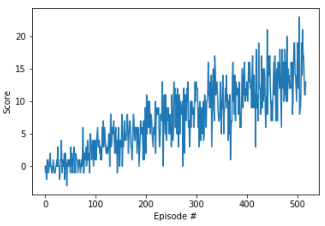

# Deep Q-Network: Banana Problem Report

This report describes the implemenation of a deep Q-network (DQN) to solve the banana problem.

## Learning Algorithm

This problem is solved using a Deep Q-Network approach. This is a similar to traditional value function approaches in reinforcement learning but uses a neural network to approximate the value function over a continuous space rather than a modeling the Q function as a lookup table over a discrete space. 

The neural network architecture consists of two 64-node linear hidden layers with ReLU (rectified linear unit) activation functions. 

The overall hyperparameters are:
- Replay buffer size: 1e5
- Minibatch size: 64
- Discount factor: 0.99
- Soft update factor: 1e-3
- Learning rate: 5e-4
- Network update frequency: 4

The training hyperparameters are:
- Max training of episodes: 2000
- Max timesteps per episode: 1000
- Starting epsilon-greedy epsilon: 1.0
- Ending epsilon-greedy epsilon: 0.01
- Epsilon decay rate: 0.995

These parameters were chosen becaues they were effective in previous examples in other domains. The banana collection task is relatively straightforward, so these parameters produced sufficient performance in the banana domain although they were not optimized for that problem. 

## Results

This implementation solved the problem by achieving an average reward of at least +13 over 100 episodes in less than 600 total episodes. The full results are shown below. The saved weights are available [here](./dqn/checkpoint.pth). 

## Future Work

The agent's performance could be improved by implementing various DQN extensions. The most effective option would likely be to implement rainbow DQN. 
